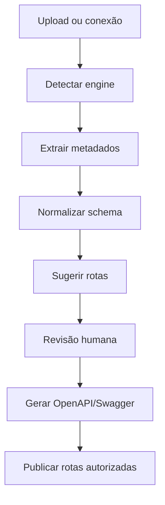

# Escopo do Projeto — Gerenciador Web de API por Engenharia Reversa de Banco

## 1. Visão geral

O projeto tem como objetivo criar um gerenciador web capaz de receber estruturas de banco de dados, mapear seus objetos internos e gerar rotas de API documentadas em uma experiência semelhante ao Swagger.

O sistema deve permitir que o usuário cadastre diferentes estruturas, valide o mapeamento gerado, revise as rotas sugeridas, publique endpoints autorizados e gerencie clientes com API keys isoladas por tenant.

Nesta primeira entrega, o front-end está em formato de protótipo funcional e interativo, com dados demonstrativos e fluxos simulados.

## 2. Objetivo principal

Construir uma plataforma para:

- cadastrar estruturas de banco;
- fazer upload ou leitura de schemas;
- identificar o tipo de origem;
- mapear tabelas, campos, chaves, triggers, procedures, views, functions, coleções ou models;
- gerar rotas de API a partir do mapeamento;
- exibir documentação e testes no estilo Swagger;
- controlar clientes e credenciais;
- garantir segurança, isolamento e governança.

## 3. Bancos e origens suportadas no escopo

O projeto deve ser preparado para múltiplas engines e tipos de estrutura:

| Origem | Tipo | Estratégia de leitura |
|---|---|---|
| Firebird | Relacional | Leitura das tabelas de sistema `RDB$` |
| PostgreSQL | Relacional | `information_schema` e `pg_catalog` |
| MySQL | Relacional | `information_schema` |
| MariaDB | Relacional | `information_schema` |
| SQL Server | Relacional | `sys.tables`, `sys.columns`, `sys.procedures` |
| MongoDB | NoSQL | Coleções, amostras de documentos e JSON Schema |
| Node/ORM | Código/modelos | Prisma, Sequelize, TypeORM, models JS/TS |
| Outros | Adaptável | Importação via JSON, ZIP ou adaptador futuro |

## 4. Fluxo funcional desejado



## 5. Módulos do sistema

### 5.1 Dashboard

Visão geral da operação da API:

- quantidade de bancos cadastrados;
- quantidade de rotas geradas;
- clientes ativos;
- engines suportadas;
- saúde da API;
- atividade recente;
- fluxo de publicação.

### 5.2 Cadastro de estruturas

Permite cadastrar uma nova origem de dados.

Campos previstos:

- nome da estrutura;
- tipo da origem;
- versão/dialeto;
- ambiente;
- arquivo ou origem técnica;
- status de mapeamento.

Exemplos de arquivos aceitos:

- `.fdb`;
- `.sql`;
- `.dump`;
- `.bak`;
- `.dacpac`;
- `.json`;
- `.bson`;
- `.js`;
- `.ts`;
- `.prisma`;
- `.zip`.

### 5.3 Upload e mapeamento de rotas

Área responsável por simular ou executar o processo de engenharia reversa.

Funcionalidades:

- seleção da engine;
- upload de estrutura;
- validação do formato;
- identificação de objetos;
- cálculo de confiança do mapeamento;
- listagem das rotas sugeridas;
- envio das rotas para a documentação interativa.

### 5.4 Catálogo de objetos

Permite explorar os objetos identificados na estrutura.

Objetos previstos:

- tabelas;
- campos;
- chaves primárias;
- chaves estrangeiras;
- índices;
- triggers;
- procedures;
- functions;
- views;
- collections;
- models;
- schemas.

### 5.5 Rotas e Swagger

Experiência semelhante ao Swagger para:

- visualizar endpoints;
- filtrar por método;
- consultar parâmetros;
- visualizar escopos;
- testar requisições em sandbox;
- exportar OpenAPI JSON;
- revisar rotas antes da publicação.

Exemplo:

```txt
CLIENTES
→ GET /clientes
→ GET /clientes/{id}
→ POST /clientes
→ PATCH /clientes/{id}
```

### 5.6 Gestão de clientes e API keys

Área para controle de tenants e credenciais.

Requisitos:

- cadastrar cliente;
- vincular cliente a uma estrutura/banco;
- gerar API key;
- rotacionar API key;
- revogar API key;
- nunca exibir segredo em texto puro;
- mostrar apenas chave mascarada, prefixo e fingerprint;
- controlar escopos por cliente.

## 6. Segurança obrigatória

O sistema deve ser projetado com segurança desde o início.

Regras fundamentais:

- nunca salvar API key em texto puro;
- armazenar apenas hash do segredo;
- exibir somente prefixo/fingerprint;
- isolar dados por tenant;
- aplicar escopos por rota;
- registrar logs de acesso;
- registrar auditoria de alterações;
- aplicar rate limit por cliente;
- bloquear campos sensíveis por padrão;
- exigir aprovação para rotas de escrita;
- descartar arquivos enviados após extração dos metadados, quando aplicável.

## 7. Arquitetura recomendada

### Front-end

Protótipo atual:

- HTML;
- CSS;
- JavaScript puro;
- interface responsiva;
- dados demonstrativos.

Evolução recomendada:

- React ou Next.js;
- componentes reutilizáveis;
- estado global;
- integração com backend;
- autenticação real.

### Backend

Stack recomendada:

- Node.js;
- NestJS ou Fastify;
- PostgreSQL para o banco do gerenciador;
- Redis para cache, fila e rate limit;
- BullMQ ou RabbitMQ para processamento assíncrono;
- OpenAPI dinâmico;
- workers para leitura de schemas.

### Banco do gerenciador

Deve armazenar:

- estruturas cadastradas;
- engines;
- objetos mapeados;
- campos;
- relações;
- rotas;
- versões de schema;
- clientes;
- API keys;
- logs;
- auditoria.

## 8. Modelo de dados inicial sugerido

Tabelas principais:

- `workspaces`;
- `database_sources`;
- `schema_versions`;
- `schema_objects`;
- `schema_fields`;
- `schema_relations`;
- `mapped_routes`;
- `route_versions`;
- `clients`;
- `api_keys`;
- `api_key_scopes`;
- `request_logs`;
- `audit_logs`.

## 9. Endpoints iniciais do backend

### Estruturas

```txt
POST /admin/database-sources
GET /admin/database-sources
GET /admin/database-sources/{id}
POST /admin/database-sources/{id}/upload
POST /admin/database-sources/{id}/map
```

### Catálogo

```txt
GET /admin/schema-objects
GET /admin/schema-objects/{id}
GET /admin/schema-objects/{id}/fields
GET /admin/schema-objects/{id}/dependencies
```

### Rotas

```txt
GET /admin/routes
POST /admin/routes/generate
PATCH /admin/routes/{id}
POST /admin/routes/{id}/approve
POST /admin/routes/publish
GET /openapi.json
```

### Clientes e chaves

```txt
POST /admin/clients
GET /admin/clients
POST /admin/clients/{id}/api-keys
POST /admin/api-keys/{id}/rotate
POST /admin/api-keys/{id}/revoke
```

### API publicada

```txt
GET /v1/{resource}
GET /v1/{resource}/{id}
POST /v1/{resource}
PATCH /v1/{resource}/{id}
DELETE /v1/{resource}/{id}
```

## 10. MVP funcional recomendado

### Fase 1 — Protótipo navegável

Status: entregue nesta pasta.

Inclui:

- dashboard;
- cadastro de estrutura;
- upload demonstrativo;
- mapeamento simulado;
- catálogo;
- Swagger simulado;
- clientes e API keys demonstrativas.

### Fase 2 — Backend inicial

Construir:

- API administrativa;
- banco do gerenciador;
- upload de `.sql` e JSON;
- parser inicial;
- persistência de estruturas;
- geração real de rotas sugeridas;
- OpenAPI gerado dinamicamente.

### Fase 3 — Firebird real

Construir:

- conector Firebird;
- leitura de metadados `RDB$`;
- mapeamento de tabelas, campos, triggers e procedures;
- geração de rotas baseada em PK/FK;
- bloqueio de objetos sensíveis.

### Fase 4 — Multi-engine

Adicionar:

- PostgreSQL;
- MySQL;
- MariaDB;
- SQL Server;
- MongoDB;
- Node/ORM.

### Fase 5 — Produção

Adicionar:

- autenticação;
- permissões administrativas;
- API keys reais;
- rate limit;
- logs;
- auditoria;
- versionamento de rotas;
- sandbox de testes;
- deploy escalável.

## 11. Pontos críticos

Pontos que exigem atenção máxima:

- não expor dados reais no upload;
- não gerar rota de escrita sem revisão;
- não expor tabelas técnicas ou sensíveis;
- não exibir API keys em claro;
- isolar cada cliente por tenant;
- validar concorrência;
- tratar migrations e alterações de schema;
- manter versionamento das rotas;
- registrar auditoria completa;
- ter rollback de publicação.

## 12. Critério de sucesso da MVP

A MVP será considerada funcional quando permitir:

- cadastrar uma estrutura;
- enviar um arquivo de schema;
- identificar objetos;
- salvar metadados;
- gerar rotas sugeridas;
- aprovar rotas;
- consultar OpenAPI;
- testar uma rota em sandbox;
- cadastrar cliente;
- gerar API key mascarada;
- autenticar chamada usando API key;
- registrar log da requisição.

## 13. Observação sobre o front entregue

O front-end incluído nesta entrega é um protótipo interativo em HTML, CSS e JavaScript puro.

Ele não possui backend real nesta etapa. As ações de upload, validação, mapeamento, geração de rotas e requisições são simuladas para representar a experiência final esperada.

Para torná-lo funcional em produção, será necessário conectar este front a uma API real conforme o escopo descrito neste documento.
